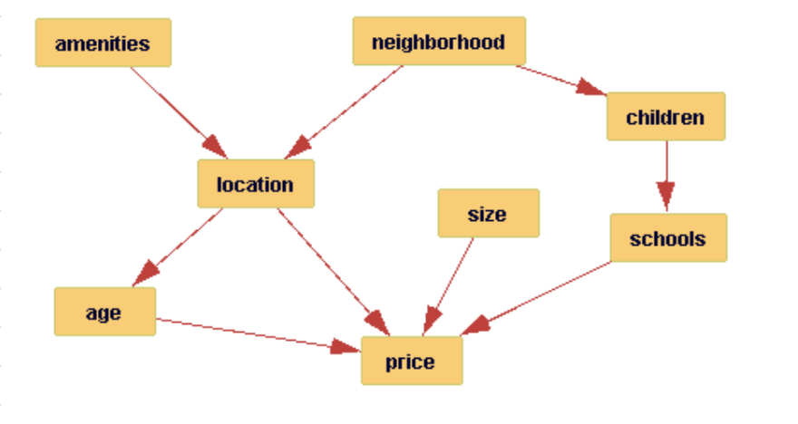
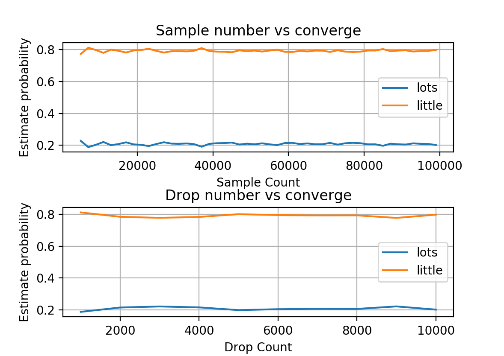

# Gibbs-Sampling
Uses Gibbs sampling to compute conditional probabilities for a Bayesian network.

# Features
The specific network structure:

# Usage

python gibbs_sampling.py gibbs size schools=good location=ugly -u 10000 -d 0

Would query the node size, given evidence location=ugly and schools=good.  It would run 10000 iterations of gibbs sampling, and discard none of the observations.
 

# Licence
This project is under MIT License